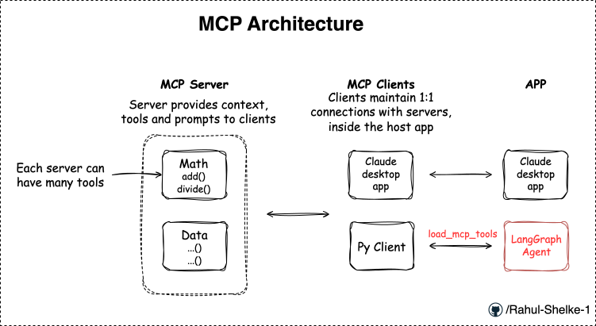
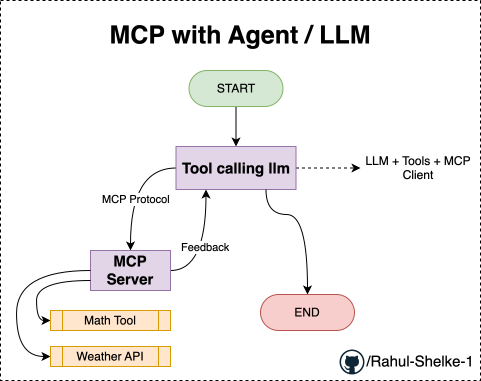
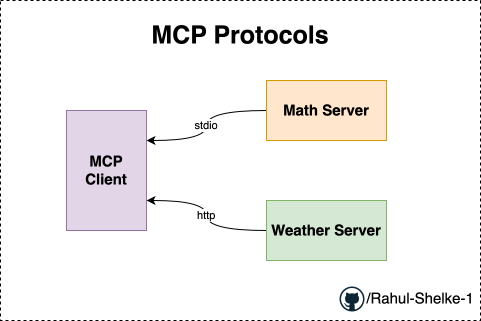

# MCP Concept 

## MCP Flow

Above diagram represent the overall conceptual designing goes behing the MCP architecture.

## MCP with Agent/LLM

## Finally Achived MCP Communication:

- Created MCP Client & communicated 2 MCP Servers

    - To `math server` with `stdio` protocol. (communicating with `terminal / command prompt`)
    - To `weather server` with `http` protocol. (communicating with `url`)

