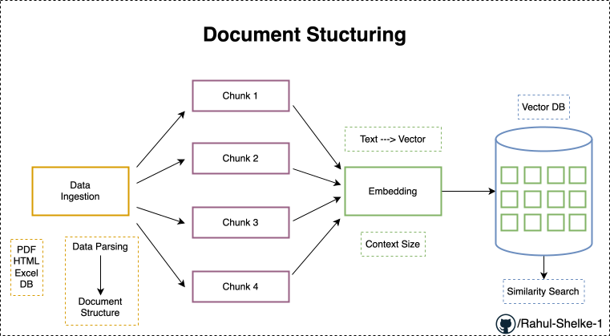

# Document Structure

*[figure 4.1]*

When ever we work with any external knowledge database or data that needs to be feeded into the vector DB we definitely need to know about this document structure.

We might ask our self **"Why ?"**

## RAG Pipeline

*[figure 4.2]*

Because in this data ingestion pipeline [figure 4.2] the first step is data ingestion. when ever we talk about data ingestion there we can have any kind of files like PDF file, HTML files, DB file, Excel file. Our main aim is to read all this particular file content and probably convert it into a structure where in we can additionally do like apply strategies like chunking, embedding and storing into vector DB, that is what this entier pipeline is all about.

so for that we really need to understand this "Document Structuring".

refer the figure 4.2, initially we data ingesion pipeline, In that pipeline first step is data injection, that means basically we may have different kinds of files like pdf, html, excel and database files, unstrcutred file or any other kind of files.

So in data ingetion our main strategy is that *how to proceed with reading this particular file ?*, *how to perform data parsing ?*, and then *how to convert this into document structure ?* this are the reasons we have to understand "Dcument Structuring" and 

- how to build thsi "Document Structure" ?
- What is metadata ?
- How the structure of metadata exists ?

**Data Parsing** :this step is really important, in the retrival pipeline i.e., quiery retrival pipeline based on this parsing it can become much more efficient, we will be able to get much more accurate in results.

After data pasring we need to do **chunking**

In chunking we convert entier documents into chunks, multiple chunks, this strategy is all about breaking big documents into small parts or smaller chunks.

Again we might ask our self **Why?** (chunk big documents into small parts).

the reason we do this because when ever we consider with respect to any LLM model or any embedding models we need to embed the document, with respect to every LLM model , there is fixed context size.

for example,

if we take all 100 page document/pdf completely give it to the llm model for performing the embeddings and embedding basically means we convert text into embedding vectors. it will not be possible.it will say "hey you are proving data more that my context size" and that will not be possible to conbvert the text into embedding vectors.

so with in the limits of the context size we need to give the data, and this is for both embedding model and even in later stages whenevr we use any kind of LLM model , because for every LLM model there is a fixed context size.

different LLM may have different-different context size.

so this is a good stratgy that we try to divide our data into chunks so that we fit them in a way that in later stages we'll be able to put them into the vector databases.

Afte embedding we store data into vector database, inside the vector db , the chunks will be stored in the form of vectors.

after this from the vector db we will be able to apply the any kind of similarity search, to retrive the similar data chunks.