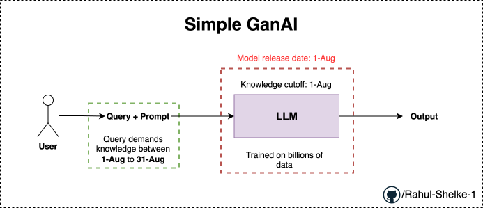
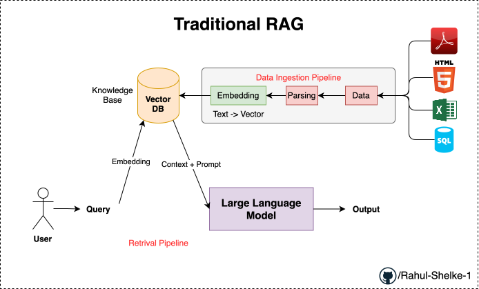
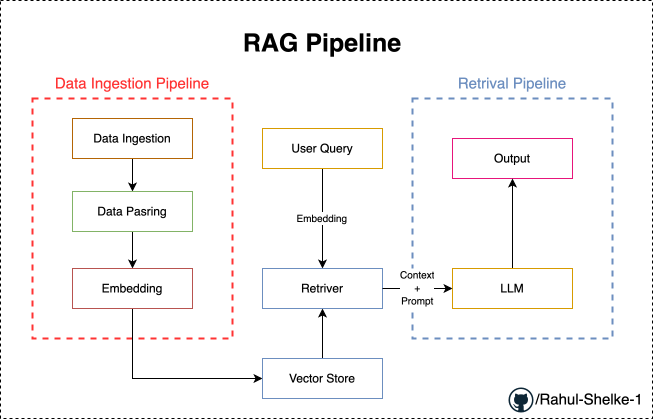

# RAG : Retrival Augmented Generation

Retrival Augmented Generation (RAG) is the process of optimizing the **output of a large language model**, so it references an **authoritative knowledge base** outside of its **training data sources** before generating a response. Large Language Models (LLMs) are trained on vast volumes of data and use billions of parameters to generate original output for tasks like answering questions, translating specific domains or an optimization's internal knowledge base, all without the need to retrain the model. It is a cost-effective approach to improving LLM output so it remains relevant, accurate and useful in various contexts.

## Example: Understanding the Importance of RAG Using the Above Diagram

Above is the simple genai application where in the LLM is used to generate the content.

It follows a simple flow: the user inputs a query, which gets embedded with a prompt, and the LLM (trained on billions of data points) generates the output once the prompt is provided.

**1. Disadvantage of this approach:**

As we know, every LLM is trained on a specific dataset. Consider a scenario where today is `31-August`, and the LLM was trained on data up to `1st-August`.

The LLM will have no knowledge of events that occurred between `1-August` and `31-August`.

NOW, if a user asks a question about events that occurred between `1st` and `31st` August:

The LLM will start **hallucinating**-which is one of the major disadvantages of LLMs.

### *Q. when we say hallucinating what does this bacially mean?*

It means that even though it lacks knowledge of events between `1st August` and `31st August`, the LLM will still try to generate an answer rather than admit it doesn't know. It generates a response designed to sound convincing so that you believe it. This condition is called *"hallucination"*.

**NOTE: LLMs provide output in such way that it pleases the user.**

**2. Disadvantage of this approach:**

Let's say we are using an LLM trained on a huge amount of data. Suppose I am running a startup to solve a specific use case, and I need to use my own proprietary data alongside the LLM.

For example, this data includes Company policies, HR policies, and Finance policies. None of these policies are publicly available because they belong to my startup. I want to use this specific data to create my own custom chatbot.

*Now, How do i do this?*

We have 2 approaches to achive this:

**Approach 1:**

Take all of this internal data and fine-tune the model.

Trade-off: Fine-tuning is a great solution, but on the other hand, it can be a very expensive and tedious process. Because the LLM has billions of parameters, fine-tuning takes a significant amount of time and effort.

So while this is a valid solution, it is very costly.

**NOTE:** These policy documents will keep updating as the startup grows, and we cannot continuously fine-tune the LLM every time a policy changes.

This issue can be resolved with the 2nd approach.

**Approach 2:**

Now, let's look at how this is resolved with the help of RAG.

<!-- ## RAG Pipeline

 -->

