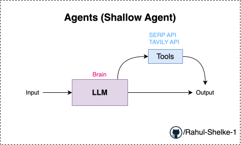
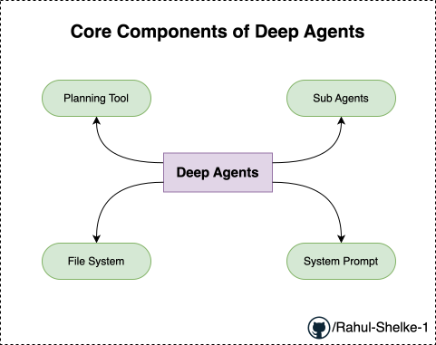
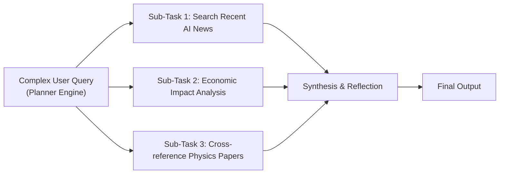

# Deep Agents

1. Agents (Shallow Agent)

2. Deep Agents

#### 1. How a Shallow Agent Works

* **Core Mechanism:** A shallow agent receives an input query, passes it to the LLM, and applies a single decision layer: *Do I have enough knowledge to answer directly, or do I need to query an external tool?*
* **Tool Integration:** Tools can range from web search APIs, python code interpreters, SQL database connectors, or custom external APIs.

#### 2. Structural Limitations of Shallow Agents

While efficient for simple utility tasks (e.g., *"What is the current temperature in Mumbai?"*), shallow agents struggle with multi-faceted workflows due to four primary bottlenecks:

| Limitation | Impact on Workflow |
| --- | --- |
| **No Explicit Planning** | Operates reactively in a single turn rather than mapping out multi-step dependencies or backup strategies. |
| **No Query Decomposition** | Fails to break down compound or cross-domain questions into manageable sub-tasks. |
| **Simple Loops & Limited Memory** | Retains short-term context inefficiently across continuous interactions, leading to memory loss or context drifting. |
| **Inflexibility on Error** | If a tool returns invalid or unexpected data, shallow agents typically lack self-reflection or corrective retry mechanisms. |

---

### Why Shallow Agents Fail on Complex Queries

Consider your complex example query:

> *"Provide me recent AI news that is happening today, explain how it is probably related to economics, and analyze how it intersects with the latest developments in physics."*

A shallow agent will usually attempt to search for all these domains in a single query or hallucinate connections because it cannot execute a multi-tier plan.

### ReAct Agent

ReAct agnet is one of the most commong agent. Inside ReAct agent what happens is that , lets say we have a LLM, this LLM is actually connected to many tools (tools like wikipedia, serp, tavily etc). when ever input query comes , llm is assigned with some system. prompt , based on input query llm will make a decision to which tool to call. after output is generated by the tool then context is sent back to the llm, as name suggests **Re-Act** (Recursive Actions) the model can act any numbers of time based on observation and based on the context getting from the tools , once complex query is solved then we'll be able to see the final output.  

Example: 
> if input query is : Whta is 2 + 2 and then multiply by 5

in this scenario `Whta is 2 + 2` this will be answered 1st and then `then multiply by 5`, then both the contexts will be assumed to generate the final output. 

In ReAct,, loop is happening, and tools are being called, and context fetched again and again till the query is resolved, nothig is happening more than that. (no planning, no structured plan, no deep reasoning, no state management , no persistent memeory), it is just given a request , tools are being used and this continuous loop is basically happening. 

#### How an Advanced (Deep) Agent Solves This

in case of deep agents , deep agents works completely different. We don;t say this as shallow agents, because this is completely different. some of the examples of deep agents are *deep researched in ChatGPT*, *Clause*, *Manus AI*

**In the case of Deep Agenets, how they are different from shallow agents ?**

here the architecture is complete different.

this 4 properties talks about the characteristics of the deep agents.

when ever query comes, it is not directly hitting tool or llm to give output, first there will be some kind of planning tool

1. Planning Tool 
2. Sub Agents
3. System Prompts
4. File System

this are the 4 core componenets of the deep agents

now in order to build more understanding will take example of claude code,

in order to develope this deep agents there will be definitely a [system prompt](https://github.com/Rahul-Shelke-1/claude-code-system-prompt/blob/main/claudecode.md) for reference

1. **Planning Tool**: some kind of planning will happen , basically some kind of TODO list, let's say we query

> I want to book a holidays plan to paris in the budget of 100k rupees, and i want it for 3 nights and 4 days

this is the entire query, i have actually given, now what will happens is that, as soon as i give the query to my deep agent, the first thing is that the planning will happen. planning means we are just going to go ahead and do a TODO list, like how we are going to cover this or how this entire plan can be made, first of all lets say first day is basically to travel to paris. stay in this perticular hotel the prices is so and so, second day breakfast have over here, go and visit Eiffel Tower, third day will be go and visit some other place, see somthing and fourth day come back to india, go to flight and this is the cost everyday cost. so this is the TODO list , what to have what not to book each and everything. after this TODO list given we go to the second important componenet that is called "sub-agent"

2. **Sub-Agent**: This above TODO list needs to be executed by some one, so here will create sub agents, so like for each task of TODO list will deligate a sub agent, and each sub agent will be responsible to solve the given task. 

3. System Prompt: To solve this perticular tasks will also require "System prompts", like how my agent should basically behave. refere this [system prompt](https://github.com/Rahul-Shelke-1/claude-code-system-prompt/blob/main/claudecode.md)

4. **File System**: then comes the file system, this is like a persistent memory which will be accessable to all the sub agents, now sub agents can probably do any kind of task, save in this persistent memory which will be in the form of a file system which can be a specific file. it can be a shred memory or it can be something. all this subagents can basically communicate with each other.

so this is the way any deep agent can carry out any complex task and generate the output.

To solve complex queries, advanced agentic architectures (such as ReAct, Plan-and-Solve, or Multi-Agent orchestration) introduce explicit planning and memory layers:

1. **Decomposition & Planning:** The agent breaks the request into distinct execution nodes (AI news search, economic analysis, physics search).
2. **Iterative Tool Execution:** It executes tools sequentially or in parallel for each sub-task, feeding intermediate outputs back into the context window.
3. **Self-Correction & Reflection:** It checks intermediate results to verify accuracy before finalizing the response.
4. **Context & Memory Management:** Uses specialized memory stores (e.g., Vector DBs or conversation history compression) to preserve key facts without overflowing the LLM’s context window.