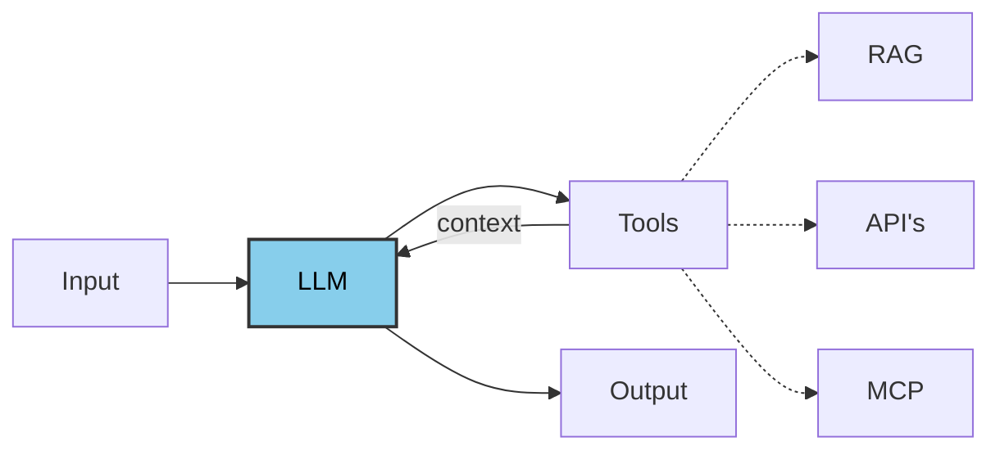

# Guardrails

Guardrails are safety mechanisms that control what goes into and comes out of an AI agent.

They sit around your agent pipeline and ensure the agent:

- only processes safe, appropriate inputs
- only performs approved actions
- only returns validated, compliant outputs

In above scenario, whatever question you ask to the LLM, the LLM based on the request qill generate a output either taking the context from the tools or either it will generate its own output, So here after geerating the output you get the entire output itself.

But when ever we talk about guardrail, don't you think, let's say if in the input 

> Hey, How to ask a server ?

Do you think this question is appropriate ?

When ever user ask such queries those a ethically unappropriate or unsafe message. LLM should be able to flag such content or before going inputs to model some checks should happen before hand, and should get flagged, so this way input and output always been validated, and governed or the rules and regulations we have defined.

We want LLM to process only safe appropriate inputs only perform approved actions only , return validated , compliant outputs.

So entier workflow we can implement different types of guardrails.

## How do we implement GuardRails?

In AI agents there 2 approaches to guardrails:

## 1. Deterministic Approach (rule-Based)

### Advantages:

- Define rule based algorithms: regex, keyward matching
- Zero LLM cost

### Disadvantages:

- Won't understand symantics

## 2. Model Based Approach (As-a-Judge)

### Advantages:

- Uses LLM
- Symantic Matching
- Can add violations

### Disadvantages:

- Frequest LLM calls will increase the cost.

We will use Langchain framework to debelope guardrails in the form of middleware, with in the workflow we can add number of hooks

1] PII Middleware

- Built in Detection email id, credi card id, IP's
- With middleware we can apply masking, hashing
- Can apply of steps like input, output, tool call.

2] Human In The Loop

- it pauses agents before using sensitive tool
- for human approval or rejection
- have to implement it with threads and checkpoints, to make it understand for which user we trying to talk.

3] Before Agent Hook

- Rin before LLM calls
- zero cost for blocked requests
- if get blocked we can move it to end state

4] After Agent Hook

- if agent has already executed and generated output , after that also we can validate final response before user sees it.

- It can replace or mutate unsafe content

5] Layred Guardrails

