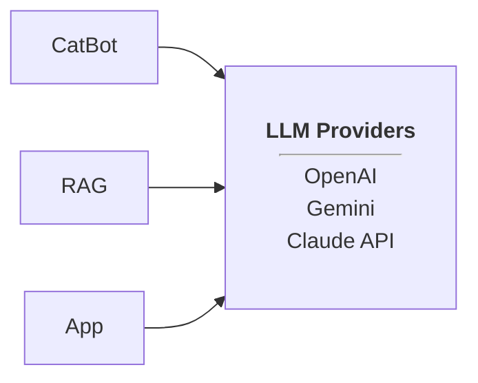
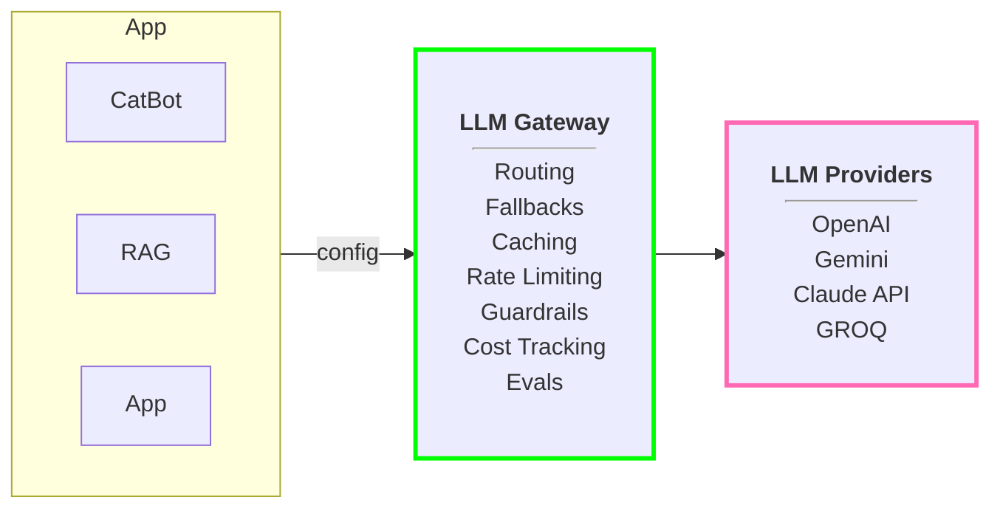

# LLM Gateways

Let's consider we are runing a startup, in that startup we have deloped a chatbot which serves some kind of purpose.
and say also have RAG application and we also have different types of AI applications that we have built.

So in case of chatbot we are using *OpenAI* llm provider, for rag using *Google Gemini* and for ai apps using *Claude* api ,
while developeing this applications we must have written the code for each different/individual api integration or some kind of SDKs.

In [November 8th, 2023](https://voicebot.ai/2023/11/08/breaking-openai-api-and-chatgpt-experiencing-major-outage/) OpenAI suffered a severe multi-hour outage. this outage was because of OpenAI API key went down, due to which chatbot application will go down, it will not give any kind of response, companies like *Cursor*, *Notion* which was specifically using openai apis at that point of time, all the customer support bots they had create were out of service, all went down/ not working.

Now, if any of this api's goes down and your application shoud be keep working without going down, this is achived and possible with LLM Gateway.

LLM gateway is a smart middleware, it exists in between ai app and llm provider.

there are amazing functionalities provided by the gateway like routing, fallbacks, caching, rate limiting, guardrails, cost tracking, evals and many more things.

here our apps are not directly communicating with llm provider, they are comminicating through llm gateway, it is redirecting request to specific / available / task specific llm provider and then giving back the response back to the user irrespective of application we are actually using.

this way will not be writing api integrations code for every llm providers that we have.

Core Capabilities:

1. Unified API
2. Automatic Fallbacks
3. Smart Routing
4. Load Balancing
5. caching
6. Observability
7. Guardrails
8. Evals
